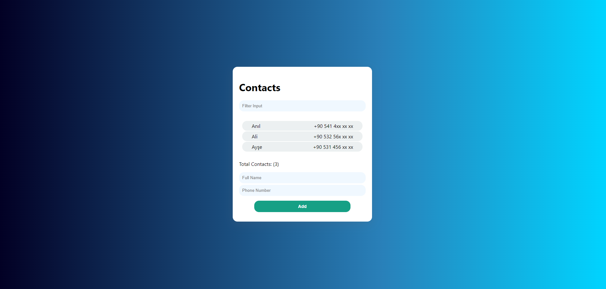
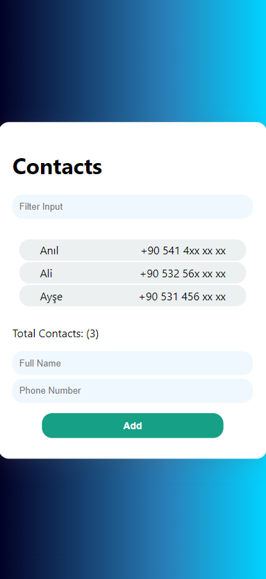

## Overview

### Screenshot

### Links

- Live Site URL: [https://safaanilatasoy.github.io/frontend-mentor-projects/faq-accordion/]

## My process

### Built with

- Semantic HTML5 markup
- CSS custom properties
- Flexbox
- CSS Grid
- Mobile-first workflow
- Booststrap
- React

### What I learned

In this project, I gained experience in development using React. I became proficient in designing user-friendly and mobile-responsive interfaces. I enhanced my skills in creating interactive user interfaces with React and in crafting modern designs using CSS that align with current standards. Additionally, I further familiarized myself with the React structure and gained experience in React.js.

### Useful resources

- [Flatui](https://flatuicolors.com) - Thanks to this website, I can easily switch between color palettes and conveniently copy my favorite colors with just a single click. I highly recommend it!
- [Github Pages](https://pages.github.com/) - I was able to easily take my project live by simply creating a repository, so I highly recommend it.
- [Gradient.io](https://cssgradient.io/) - Thanks to this website, you can easily create gradient backgrounds. It's user-friendly and equally practical; I highly recommend it.
- [Box shadow dev](https://box-shadow.dev/) - "By using this website, you can quickly and easily apply CSS shadow effects.

## Author

- LinkedIn - [@safaanilatasoy](https://www.linkedin.com/in/safaanilatasoy/)
- Github - [@safaanilatasoy](https://github.com/safaanilatasoy)
- Frontend Mentor - [@safaanilatasoy](https://www.frontendmentor.io/profile/safaanilatasoy)
- HackerRank - [@safaanilatasoy](https://www.hackerrank.com/profile/safaanilatasoy)
